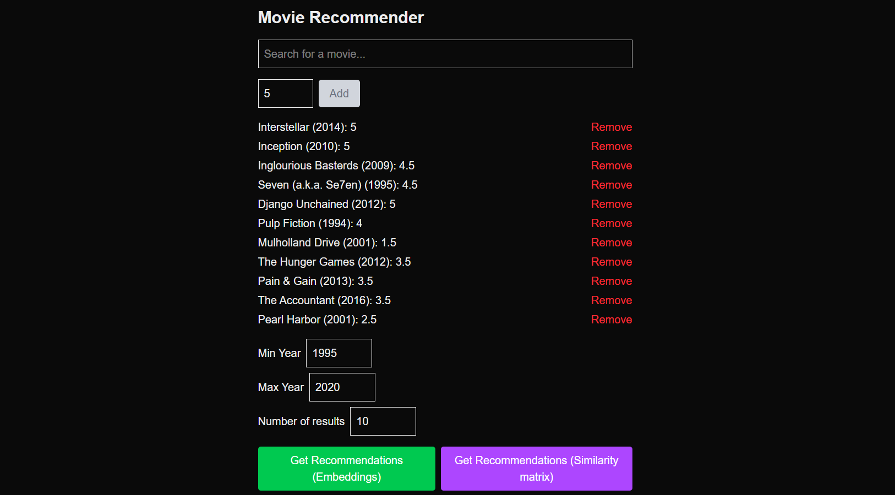
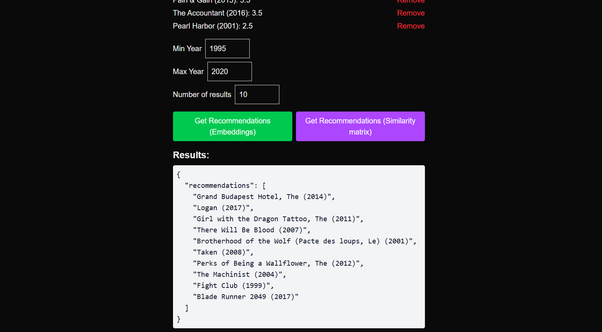

# Movie Recommendation System

A movie recommendation system built from scratch using Pandas, PyTorch and Flask + Next.js stack for serving predictions. The system provides two complementary recommendation methods: 

1. Neural embedding-based collaborative filtering: learns low-dimensional latent embeddings for users and movies to predict ratings using a simple PyTorch model.

2. User-user collaborative filtering: computes recommendations based on similarity between users’ rating patterns using Pearson correlation.

The project handles technical challenges, including filtering sparsely-rated movies and mitigating overfitting, to provide reliable top recommendations.

## Features

#### Neural embeddings based collaborative filtering with PyTorch 

Learned low-dimensional embeddings for users and movies. 

Optimized using MSE loss with Adam optimizer.

Supports inference for new users via lightweight embedding optimization. 

#### User-user collaborative filtering with Pandas

Computes recommendations based on similarity between users’ rating patterns using Pearson correlation.

#### Web API with Flask

/recommend: Embedding-based recommendations. 

/recommend-simple: User-user recommendations. 

The responses are JSON

#### Frontend (Next.js)

Simple UI to interact with the backend API. Uses fetch to query recommendations in real-time.

## Preprocessing

Movies with fewer than N ratings are filtered out to reduce noise. 

Users with no ratings left after the previous step are removed.

Ratings are reindexed into contiguous user/movie IDs for embedding layers.

## Challenges I encountered:

#### 1. Overfitting 

**Problem:** Initial training produced much lower train loss compared to test loss (~0.6 train vs ~1.2 test). This is because the model was overfitting to the training set, memorizing user-movie interactions rather than learning generalizable patterns. 

**Solution:** Introduced regularization (weight_decay in Adam). Increased dropout on embeddings. Carefully tuned the number of epochs and embedding dimensions. This results in final losses balanced at ~0.55 (train) and ~0.87 (test), significantly narrowing the gap.

#### 2. Data Preprocessing

**Problem:** Some movies had very few ratings (sometimes only 1–2 users). If those users rated the movie highly, the system gave it a disproportionately high recommendation score, even though there was no broad consensus. 

**Solution:** Filtered out movies with fewer than 5 ratings. This improved model stability and produced less noisy, more realistic recommendations.

## Tech Stack

Backend: Python, PyTorch, Flask, Pandas, scikit-learn 

Frontend: Next.js (React), TypeScript, TailwindCSS

Data: MovieLens 100K dataset: movies.csv and ratings.csv 

## Key Learnings

Successful machine learning deployment isn’t just about the model itself, but also about designing a clean workflow: preprocessing raw data, training models, and exposing predictions through an API must each be handled independently, so changes in one step don’t break the others.

Data preprocessing is just as important as model design. Raw data often introduces noise that skews recommendations. 

**While effective for small datasets, the user-user collaborative filtering approach does not scale well to larger datasets due to computational cost when calculating similarity matrices. The embedding-based model is significantly faster and more scalable.**

## Visuals

Here’s a quick look at the system in action:

### Frontend UI

### Example Recommendations
